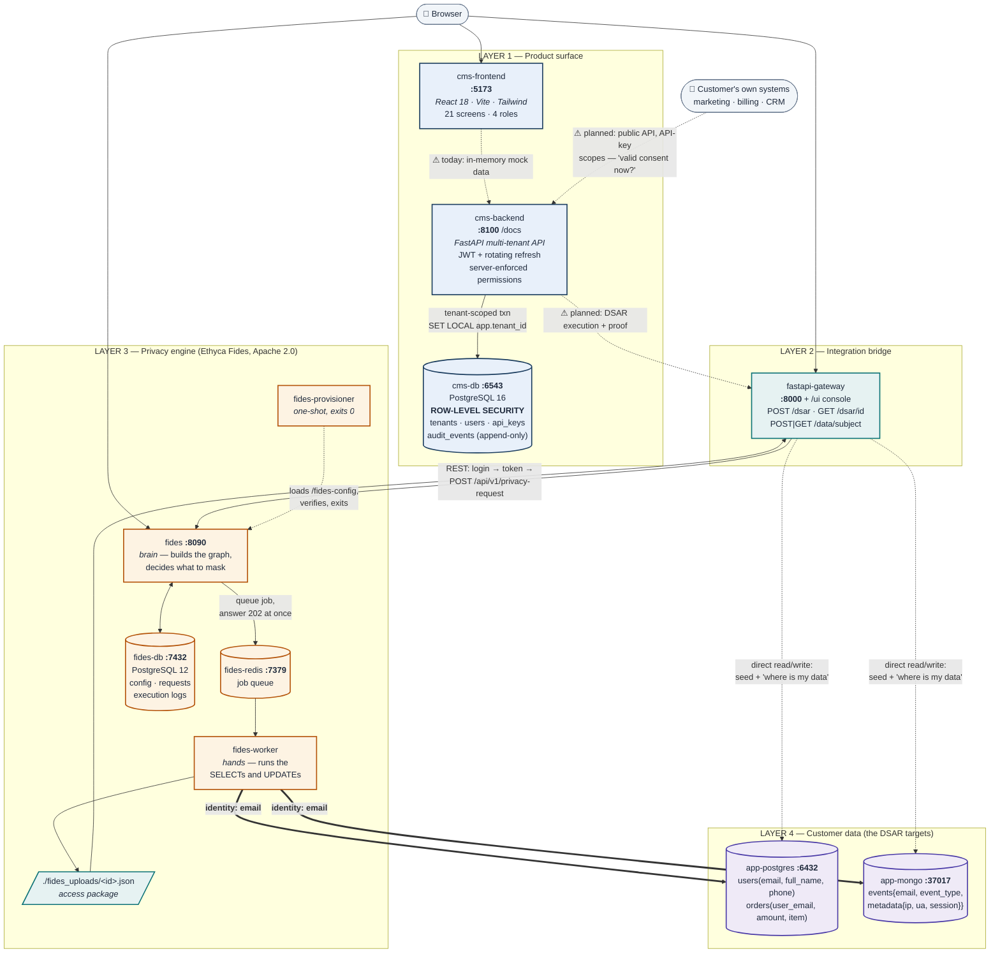

# Architecture diagram — prompt + ready-made source

Three things in here:

1. **[The prompt](#1-the-prompt)** — paste into any AI diagram tool (Eraser AI,
   Excalidraw AI, Mermaid Chart, Whimsical AI, ChatGPT, Claude, Napkin).
2. **[A short prompt](#2-short-prompt-for-image-generators)** for image models,
   which choke on long specs.
3. **[Ready-to-render Mermaid](#3-ready-to-render-mermaid)** — no tool needed;
   GitHub renders it inline.

Keep this file updated when the architecture changes, so the diagram and the code
never drift apart.

---

## 1. The prompt

> Draw an end-to-end system architecture diagram for **DataShield**, a multi-tenant
> SaaS platform for India's DPDP Act 2023 (consent management + data-subject
> rights). It has 11 containerised services in four logical layers. Use a
> left-to-right or top-to-bottom flow, group each layer in a labelled container,
> and put the port next to every service that exposes one.
>
> **LAYER 1 — Product surface (what a customer touches)**
> - `cms-frontend` — React 18 + Vite + Tailwind SPA, port **5173**. 21 screens,
>   4 roles (Data Principal, Admin/DPO, Auditor, Grievance Officer).
> - `cms-backend` — FastAPI multi-tenant API, port **8100**, Swagger at `/docs`.
>   Label it with: *JWT + rotating refresh tokens · server-enforced permissions ·
>   HMAC hash-chained audit trail*.
> - `cms-db` — PostgreSQL 16, port **6543**. Holds tenants, users, api_keys,
>   audit_events. Label it **"Row-Level Security: SET LOCAL app.tenant_id"**.
>
> **LAYER 2 — Integration bridge**
> - `fastapi-gateway` — FastAPI, port **8000**. Wraps the privacy engine's API and
>   serves a vanilla-JS proof console at `/ui`. Endpoints: `POST /dsar`,
>   `GET /dsar/{id}`, `POST/GET /data/subject`, `/health`.
>
> **LAYER 3 — Privacy engine (Ethyca Fides, Apache 2.0)**
> - `fides` — Fides webserver + Admin UI, port **8090**. The brain: builds the
>   traversal graph and decides what to mask.
> - `fides-worker` — Celery worker. The hands: actually connects to the customer
>   databases and runs the queries.
> - `fides-redis` — Redis 6.2, port **7379**. The job queue between brain and hands.
> - `fides-db` — PostgreSQL 12, port **7432**. Fides' own records: config, privacy
>   requests, execution logs.
> - `fides-provisioner` — one-shot container that runs at startup, loads the
>   version-controlled `/fides-config` (datasets, connections, DSR policies) into
>   Fides via `fides push` + REST, verifies every connection and dataset
>   reachability, then **exits 0**. Draw it dashed/detached to show it is not a
>   long-running service.
>
> **LAYER 4 — Customer data stores (the DSAR targets)**
> - `app-postgres` — PostgreSQL 16, port **6432**. Tables `users(id, email,
>   full_name, phone, created_at)` and `orders(id, user_email, amount, item,
>   created_at)`.
> - `app-mongo` — MongoDB 7, port **37017**. Collection `events {email,
>   event_type, metadata{ip_address, user_agent, session_id}, timestamp}`.
>
> **ARROWS — draw these as SOLID (built and working):**
> 1. Browser → `cms-frontend` :5173
> 2. Browser → `fastapi-gateway` :8000/ui (the proof console)
> 3. Browser → `fides` :8090 (Fides Admin UI, login root_user)
> 4. `cms-backend` → `cms-db`, labelled **"tenant-scoped transaction (RLS)"**
> 5. `fastapi-gateway` → `fides`, labelled **"REST: login → bearer token → POST /api/v1/privacy-request"**
> 6. `fides` → `fides-redis`, labelled **"queue job, answer 202 immediately"**
> 7. `fides-redis` → `fides-worker`, labelled **"worker picks up"**
> 8. `fides-worker` → `app-postgres` AND `fides-worker` → `app-mongo`, both
>    labelled **"identity: email"** — these two arrows are the point of the whole
>    system, so make them prominent.
> 9. `fides` ↔ `fides-db` (its own records)
> 10. `fides-worker` → a small file/disk node labelled `./fides_uploads/<id>.json`
>     ("access package"), and `fastapi-gateway` → that same node (reads it back)
> 11. `fides-provisioner` ⇢ `fides` (dashed), labelled **"loads /fides-config at
>     startup, then exits"**
> 12. `fastapi-gateway` → `app-postgres` and → `app-mongo` (thin), labelled
>     **"direct read/write for seeding + the 'where is my data' view"**
>
> **ARROWS — draw these as DASHED + greyed (designed, not built yet):**
> 13. `cms-frontend` ⇢ `cms-backend`, labelled **"today: in-memory mock data"**
> 14. `cms-backend` ⇢ `fastapi-gateway`, labelled **"DSAR execution + proof"**
> 15. An external node **"Customer's own systems (marketing, billing, CRM)"** ⇢
>     `cms-backend`, labelled **"Public API, API-key auth with scopes:
>     'do I have consent for this purpose right now?'"**
>
> **CALLOUTS — add these as annotation notes:**
> - On the two `fides-worker` → database arrows: *"One request reaches BOTH
>   databases because both datasets declare `identity: email`. The DSR policy
>   targets DATA CATEGORIES (user.contact, user.name, user.device), never table
>   names — so adding a third datastore needs no policy change."*
> - On `cms-db`: *"4 tenant-scoped tables, RLS FORCED. The app connects as a
>   restricted role with NOBYPASSRLS and is not the table owner. Unset tenant
>   context matches zero rows — fails closed."*
> - On `audit_events` inside `cms-db`: *"Append-only. HMAC-SHA256 chain:
>   hash = HMAC(key, entry ‖ prev_hash). UPDATE/DELETE revoked + blocked by
>   trigger."*
> - Near the four databases: *"FOUR separate data stores, four different jobs:
>   cms-db = the product · app-postgres + app-mongo = the data being erased ·
>   fides-db = the engine's own notebook."*
>
> **STYLE**
> Clean, technical, engineering-blueprint look. Rounded rectangles, one accent
> colour per layer, hairline arrows with readable labels, monospace for ports and
> paths. Include a legend distinguishing *solid = implemented* from *dashed =
> designed*. No 3D, no gradients, no drop shadows, no clip-art icons. Readable when
> printed in black and white — do not let colour be the only thing that
> distinguishes a layer or an arrow type.

---

## 2. Short prompt (for image generators)

Image models lose detail past ~120 words. Use this instead:

> Clean technical architecture diagram, engineering-blueprint style, 4 stacked
> layers, rounded rectangles, hairline labelled arrows, monospace port numbers, flat
> colours, no 3D or gradients.
> **Layer 1 "Product":** React SPA (5173) → FastAPI multi-tenant API (8100) →
> PostgreSQL with Row-Level Security (6543).
> **Layer 2 "Bridge":** FastAPI gateway (8000).
> **Layer 3 "Privacy engine":** Fides server (8090) → Redis queue (7379) → Celery
> worker; Fides' own Postgres (7432).
> **Layer 4 "Customer data":** PostgreSQL (6432, users + orders) and MongoDB
> (37017, events).
> Two bold arrows from the Celery worker to BOTH databases, labelled
> "identity: email — one request, two databases". Legend: solid = built,
> dashed = planned.

---

## 3. Ready-to-render Mermaid

No tool needed — GitHub renders this inline. Paste into
[mermaid.live](https://mermaid.live) to edit or export as SVG/PNG.

### The point of the diagram, in words

- **The two bold arrows** from `fides-worker` to both databases are the whole
  product. One request, one email, two unrelated engines — because both datasets
  declare `identity: email`, and the DSR policy targets **data categories**
  (`user.contact`, `user.name`, `user.device`) rather than table names. A third
  datastore needs annotation, not a policy change.
- **Four data stores, four jobs.** `cms-db` is the product. `app-postgres` and
  `app-mongo` are the data being erased. `fides-db` is a dependency's notebook.
  Conflating them is the most common misreading of this system.
- **The dashed arrows are the roadmap.** The frontend still runs on mock data; the
  backend does not yet call the engine; the public API does not exist. Everything
  solid is built and tested.

---

## Which tool to use

| Tool | Best for | Notes |
| --- | --- | --- |
| **[mermaid.live](https://mermaid.live)** | fastest result | paste §3, export SVG. Renders in GitHub as-is. |
| **[Eraser.io AI](https://eraser.io)** | best-looking cloud diagrams | paste §1; it handles long specs well |
| **Excalidraw + AI** | hand-drawn, whiteboard feel | good for a pitch deck |
| **draw.io / Lucidchart** | full manual control | use §1 as your checklist |
| **DALL·E / Midjourney** | a pretty picture | use §2, and expect wrong labels — image models cannot spell port numbers reliably. Not for docs. |

For a slide deck, generate the Mermaid SVG and restyle it. For engineering docs,
keep the Mermaid in the repo so it is reviewed alongside the code it describes.
